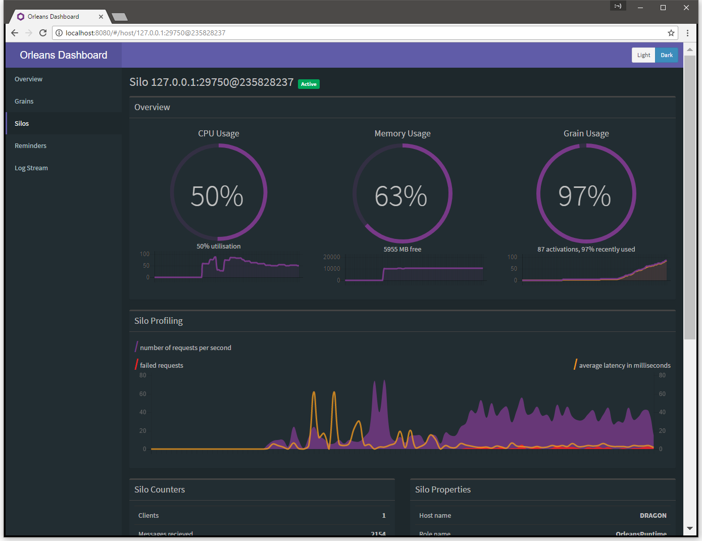

# Orleans Dashboard

[](https://ci.appveyor.com/project/richorama/orleansdashboard)

> This project is alpha quality, and is published to collect community feedback.

An admin dashboard for Microsoft Orleans.



## Installation

Using the Package Manager Console:

```
PM> Install-Package OrleansDashboard
```

Then add this bootstrap provider to your Orleans silo configuration:

```xml
<?xml version="1.0" encoding="utf-8"?>
<OrleansConfiguration xmlns="urn:orleans">
  <Globals>
    <BootstrapProviders>
      <Provider Type="OrleansDashboard.Dashboard" Name="Dashboard" />
    </BootstrapProviders>
    ...
```

...or use programmatic configuration:

```c#
var siloHost = new SiloHost(...);
siloHost.InitializeOrleansSilo();
siloHost.Config.Globals.RegisterDashboard(); // port, username and password can also be supplied
siloHost.StartOrleansSilo();
```

Start the silo, and open this url in your browser: [`http://localhost:8080`](http://localhost:8080)

## Configuring the Dashboard

The dashboard supports the following attributes in the configuration:

* `Port` : Set the the number for the dashboard to listen on.
* `Username` : Set a username for accessing the dashboard (basic auth).
* `Password` : Set a password for accessing the dashboard (basic auth).

```xml
<BootstrapProviders>
    <Provider Type="OrleansDashboard.Dashboard" Name="Dashboard" Port="1234" Username="my_username" Password="my_password" />
</BootstrapProviders>
```

## Using the Dashboard

Once your silos are running, you can connect to any of them using your web browser: `http://silo-address:8080/`

If you've started the dashboard on an alternative port, you'll need to specify that instead.

The dashboard will also relay trace information over http. You can view this in the dashboard, or from the terminal: `curl http://silo-address:8080/Trace`

## Building the UI

The user interface is react.js, using browserify to compose the javascript delivered to the browser.
The HTML and JS files are embedded resources within the dashboard DLL.

To build the UI, you must have node.js installed, and browserify:

```
$ npm install browserify -g
```

To build the `index.min.js` file, follow these steps.

```
$ cd App
$ npm install
$ browserify -t babelify index.jsx --outfile ../OrleansDashboard/index.min.js
```

## Dashboard API

The dashboard exposes an HTTP API you can consume yourself.

### DashboardCounters

```
GET /DashboardCounters
```

Returns a summary of cluster metrics. Number of active hosts (and a history), number of activations (and a history), summary of the active grains and active hosts.

```js
{
  "totalActiveHostCount": 3,
  "totalActiveHostCountHistory": [ ... ],
  "hosts": [ ... ],
  "simpleGrainStats": [ ... ],
  "totalActivationCount": 32, 
  "totalActivationCountHistory": [ ... ]
}
```

### Historical Stats

```
GET /HistoricalStats/{siloAddress}
```

Returns last 100 samples of a silo's stats.

```js
[
  {
    "activationCount": 175,
    "recentlyUsedActivationCount": 173,
    "requestQueueLength": 0,
    "sendQueueLength": 0,
    "receiveQueueLength": 0,
    "cpuUsage": 88.216095,
    "availableMemory": 5097017340,
    "memoryUsage": 46837756,
    "totalPhysicalMemory": 17179869184,
    "isOverloaded": false,
    "clientCount": 1,
    "receivedMessages": 8115,
    "sentMessages": 8114,
    "dateTime": "2017-07-05T11:58:11.39491Z"
  },
  ...
]
```

### Silo Properties

```
GET /SiloProperties/{address}
```

Returns properties captured for the given Silo. At the moment this is just the Orleans version.

```js
{
  "OrleansVersion": "1.5.0.0"
}
````

### Grain Stats

```
GET /GrainStats/{grainName}
```

Returns the grain method profiling counters collected over the last 100 seconds for each grain, aggregated across all silos

```js
{
    "TestGrains.TestGrain.ExampleMethod2": {
    "2017-07-05T12:23:31": {
    "period": "2017-07-05T12:23:31.2230715Z",
    "siloAddress": null,
    "grain": "TestGrains.TestGrain",
    "method": "ExampleMethod2",
    "count": 2,
    "exceptionCount": 2,
    "elapsedTime": 52.1346,
    "grainAndMethod": "TestGrains.TestGrain.ExampleMethod2"
  },
  "2017-07-05T12:23:32": {
    "period": "2017-07-05T12:23:32.0823568Z",
    "siloAddress": null,
    "grain": "TestGrains.TestGrain",
    "method": "ExampleMethod2",
    "count": 5,
    "exceptionCount": 4,
    "elapsedTime": 127.04310000000001,
    "grainAndMethod": "TestGrains.TestGrain.ExampleMethod2"
  },
  ...
}
```

### Cluster Stats

```
GET /ClusterStats
```

Returns the aggregated grain method profiling counters collected over the last 100 seconds for whole cluster.

You should only look at the values for `period`, `count`, `exceptionCount` and `elapsedTime`. The other fields are not used in this response.

```js
{
  "2017-07-05T12:11:32": {
    "period": "2017-07-05T12:11:32.6507369Z",
    "siloAddress": null,
    "grain": null,
    "method": null,
    "count": 32,
    "exceptionCount": 4,
    "elapsedTime": 153.57039999999998,
    "grainAndMethod": "."
  },
  "2017-07-05T12:11:33": {
    "period": "2017-07-05T12:11:33.7203266Z",
    "siloAddress": null,
    "grain": null,
    "method": null,
    "count": 10,
    "exceptionCount": 2,
    "elapsedTime": 65.87930000000001,
    "grainAndMethod": "."
  },
  ...
}
```

### Silo Stats

```
GET /SiloStats/{siloAddress}
```

Returns the aggregated grain method profiling counters collected over the last 100 seconds for that silo.

You should only look at the values for `period`, `count`, `exceptionCount` and `elapsedTime`. The other fields are not used in this response.

```js
{
  "2017-07-05T12:11:32": {
    "period": "2017-07-05T12:11:32.6507369Z",
    "siloAddress": null,
    "grain": null,
    "method": null,
    "count": 32,
    "exceptionCount": 4,
    "elapsedTime": 153.57039999999998,
    "grainAndMethod": "."
  },
  "2017-07-05T12:11:33": {
    "period": "2017-07-05T12:11:33.7203266Z",
    "siloAddress": null,
    "grain": null,
    "method": null,
    "count": 10,
    "exceptionCount": 2,
    "elapsedTime": 65.87930000000001,
    "grainAndMethod": "."
  },
  ...
}
```

### Silo Stats

```
GET /SiloCounters/{siloAddress}
```

Returns the current values for the Silo's counters.

```js
[
  {
    "name": "App.Requests.Latency.Average.Millis",
    "value": "153.000",
    "delta": null
  },
  {
    "name": "App.Requests.TimedOut",
    "value": "0",
    "delta": "0"
  },
  ...
]
```


### Reminders

```
GET /Reminders/{page}
```

Returns the total number of reminders, and a page of 25 reminders. If the page number is not supplied, it defaults to page 1.

```js
{
  "count": 1500,
  "reminders": [
    {
      "grainReference": "GrainReference:*grn/D32F2751/0000007b",
      "name": "Frequent",
      "startAt": "2017-07-05T11:53:51.8648668Z",
      "period": "00:01:00",
      "primaryKey": "123"
    },
    ...
  ]
}
```

### Trace

```
GET /Trace
```

Streams the trace log as plain text in a long running HTTP request.


